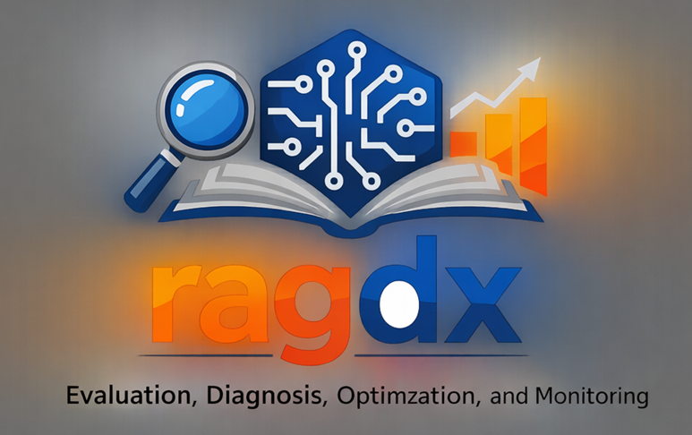
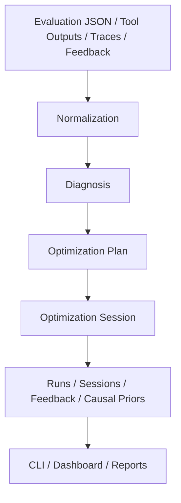

`ragdx` is a Python workbench for **RAG evaluation, diagnosis, optimization, and monitoring**.

It sits above an existing RAG application as a **quality and optimization control plane** rather than trying to replace your runtime framework, retriever stack, or orchestration layer.

## What `ragdx` does

- normalizes evaluation signals from external tools into one `EvaluationResult`
- diagnoses likely failure sources using rules, an explicit causal graph, and optional LLM reasoning
- generates staged optimization plans across corpus, retrieval, generation, orchestration, and joint layers
- executes optimization sessions in `simulate`, `prepare_only`, or `execute` mode
- persists runs, sessions, traces, feedback, and learned causal priors in a local file store
- provides both a CLI and a Streamlit dashboard for inspection and reporting

## Ecosystem fit

`ragdx` is designed to work with, not replace, tools you may already use:

- `Ragas` and `RAGChecker` for evaluation inputs
- `DSPy` and `AutoRAG` for optimization-oriented adapters
- `LangChain` and `LlamaIndex` for runtime execution

## End-to-end lifecycle



Typical workflow:

1. prepare a normalized evaluation JSON or normalize external evaluator output
2. run diagnosis
3. inspect the generated optimization plan
4. simulate or execute optimization trials
5. save runs and sessions
6. review results in the CLI or dashboard
7. attach feedback and repeat

## Installation

Python requirement:

- Python `>=3.10`

Base install:

```bash
pip install -e .
```

Optional extras:

```bash
pip install -e ".[openai]"
pip install -e ".[langchain,llamaindex,bo]"
pip install -e ".[all]"
```

Available extras:

- `openai`
- `ragas`
- `ragchecker`
- `dspy`
- `autorag`
- `langchain`
- `llamaindex`
- `bo`
- `all`

## Quickstart

Diagnose a normalized evaluation file:

```bash
ragdx diagnose examples/demo_evaluation.json
```

Generate a human-readable plan:

```bash
ragdx plan examples/demo_evaluation.json --human-readable
```

Run a simulated optimization session:

```bash
ragdx optimize examples/demo_evaluation.json --strategy bayesian --budget 8 --mode simulate
```

Inspect saved sessions:

```bash
ragdx sessions
ragdx monitor-session <SESSION_ID>
ragdx dashboard
```

Save a run and export a markdown report:

```bash
ragdx save examples/demo_evaluation.json --name baseline-demo
ragdx runs
ragdx export-report <RUN_ID> run_report.md
```

## Minimal evaluation schema

`ragdx` works from a normalized `EvaluationResult` structure. Minimal input looks like this:

```json
{
  "retrieval": {
    "context_precision": 0.68,
    "context_recall": 0.72
  },
  "generation": {
    "faithfulness": 0.81,
    "response_relevancy": 0.79
  },
  "e2e": {
    "answer_correctness": 0.74,
    "citation_accuracy": 0.77
  },
  "metadata": {
    "dataset": "demo"
  }
}
```

The schema also supports richer evidence such as:

- traces and spans
- evaluator-specific scores
- evaluator calibration data
- production or reviewer feedback events
- raw tool outputs

## Diagnosis and planning model

Diagnosis combines three layers:

1. rule-based analysis over metrics, traces, and feedback
2. an explicit weighted causal graph with priors and posteriors
3. optional LLM refinement or summary

Planning is explicitly:

- stage-aware
- baseline-relative
- multi-objective
- constraint-aware

Plans can target the following stages:

- `corpus`
- `retrieval`
- `generation`
- `orchestration`
- `joint`

The optimizer distinguishes three concepts that should not be conflated:

- `objective_weights`: trade-off coefficients
- `target_thresholds` and `target_specs`: target regions relative to baseline
- `constraint_bounds`: feasibility limits such as latency, cost, or hallucination ceilings

## CLI surface

Main commands:

- `ragdx diagnose`
- `ragdx plan`
- `ragdx optimize`
- `ragdx save`
- `ragdx compare`
- `ragdx runs`
- `ragdx sessions`
- `ragdx monitor-session`
- `ragdx normalize-tools`
- `ragdx export-report`
- `ragdx attach-feedback`
- `ragdx feedback-summary`
- `ragdx explain-plan`
- `ragdx show-runner-templates`
- `ragdx dashboard`

Dashboard entry points:

- `ragdx dashboard`
- `ragdx-dashboard`

## Execution modes

- `simulate`: validate planning and session orchestration without external runners
- `prepare_only`: emit configs and session artifacts without executing trials
- `execute`: launch external trial runners and ingest their output

Recommended starting point:

- use `simulate` first
- move to `prepare_only` once the plan shape looks correct
- use `execute` only after runner commands and runtime metadata are wired up

## LLM-backed diagnosis and planning

LLM features require the `openai` extra and an API key.

```bash
pip install -e ".[openai]"
```

```bash
export OPENAI_API_KEY=your_key
export RAGDX_OPENAI_MODEL=gpt-5.4-thinking
```

Examples:

```bash
ragdx diagnose examples/demo_evaluation.json --use-llm
ragdx diagnose examples/demo_evaluation.json --use-both
ragdx plan examples/demo_evaluation.json --use-llm-planner --human-readable
```

## Runtime integrations

For `execute` mode, configure runner commands through environment variables.

Supported runner variables:

- `RAGDX_DSPY_RUNNER_CMD`
- `RAGDX_AUTORAG_RUNNER_CMD`
- `RAGDX_LANGCHAIN_RUNNER_CMD`
- `RAGDX_LLAMAINDEX_RUNNER_CMD`

Runner templates can use:

- `{config}`
- `{output}`
- `{workdir}`
- `{trial_id}`
- `{session_id}`
- `{tool}`

Example for LangChain:

```bash
export RAGDX_LANGCHAIN_RUNNER_CMD='python examples/run_langchain_trial.py --config {config} --output {output}'
ragdx optimize examples/demo_evaluation_langchain.json --strategy bayesian --budget 6 --mode execute
```

Example evaluation metadata for a runtime-backed run:

```json
{
  "metadata": {
    "runtime_framework": "langchain",
    "dataset_path": "examples/demo_dataset.jsonl",
    "pipeline_module": "examples.langchain_pipeline:create_pipeline"
  }
}
```

## Local persistence

By default, `ragdx` stores state in local hidden folders:

- `.ragdx/runs`
- `.ragdx/optimization/sessions`
- `.ragdx/feedback`
- `.ragdx/causal/priors.json`

This makes local experimentation simple, but it is not a shared metadata service.

## Programmatic usage

```python
from ragdx.core.diagnosis import RAGDiagnosisEngine
from ragdx.optim.planner import OptimizationPlanner
from ragdx.schemas.models import EvaluationResult

result = EvaluationResult(
    retrieval={"context_recall": 0.72, "context_precision": 0.68},
    generation={"faithfulness": 0.81, "response_relevancy": 0.79},
    e2e={"answer_correctness": 0.74, "citation_accuracy": 0.77},
)

report = RAGDiagnosisEngine().diagnose(result)
plan = OptimizationPlanner().build_plan(report, result=result, strategy="bayesian", budget=8)

print(report.summary)
print(plan.objective_metric)
```

## Documentation

The detailed documentation lives under [docs](docs/README.md):

- [Overview](docs/01-overview.md)
- [Architecture](docs/02-architecture.md)
- [Data Models](docs/03-data-models.md)
- [Workflows](docs/04-workflows.md)
- [CLI and Dashboard](docs/05-cli-and-dashboard.md)
- [Configuration](docs/06-configuration.md)
- [Diagnosis and Optimization](docs/07-optimization-and-diagnosis.md)
- [Runtime Integrations](docs/08-runtime-integrations.md)
- [Extension Guide](docs/09-extension-guide.md)
- [Examples](docs/10-examples.md)
- [Limitations and Roadmap](docs/11-limitations-and-roadmap.md)

Suggested reading order for new users:

1. [Overview](docs/01-overview.md)
2. [Architecture](docs/02-architecture.md)
3. [Workflows](docs/04-workflows.md)
4. [CLI and Dashboard](docs/05-cli-and-dashboard.md)
5. [Configuration](docs/06-configuration.md)
6. [Examples](docs/10-examples.md)

## Repository structure

```text
src/ragdx/core        evaluation, normalization, comparison, diagnosis
src/ragdx/engines     rule-based and LLM diagnosis, evaluator adapters
src/ragdx/optim       planner, executor, BO adapter, runtime adapters
src/ragdx/schemas     Pydantic models
src/ragdx/storage     runs, sessions, feedback, reports
src/ragdx/ui          Streamlit dashboard
src/ragdx/utils       reporting and plan explanation helpers
examples/             example evaluations, pipelines, and trial runners
tests/                test suite
docs/                 detailed markdown documentation
```

## Limitations

Current boundaries to be aware of:

- the default store is local and file-based
- `execute` mode still depends on your runtime environment and runner scripts
- diagnosis quality depends on evaluator quality and audit quality
- LLM reasoning is a structured aid, not ground truth
- heavy Bayesian optimization backends are optional and depend on extra packages

## Testing

```bash
PYTHONPATH=src pytest -q
```
