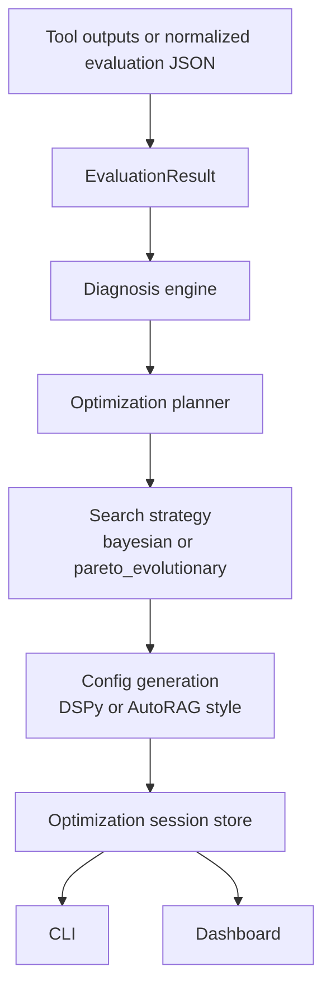

# ragdx

`ragdx` is a Python library for evaluating, diagnosing, planning, and monitoring Retrieval-Augmented Generation systems.

It acts as a control plane around existing tools instead of replacing them:

- **Ragas** for broad metric coverage
- **RAGChecker** for fine-grained retriever and generator diagnosis
- **DSPy** for generator-side prompt or program optimization
- **AutoRAG** for retrieval-pipeline search and YAML-driven experimentation

## What is new in this release

This version extends `ragdx` from diagnosis into an optimization workbench.

It now supports:

- interpreting diagnosis results into optimization rationale
- defining optimization plans with either `bayesian` or `pareto_evolutionary` search
- converting those plans into DSPy-style and AutoRAG-style configuration artifacts
- executing optimization sessions in `simulate` mode for workflow validation and monitoring
- generating configurations in `prepare_only` mode for external execution in your real runtime
- storing optimization sessions and surfacing progress in the Streamlit dashboard

## Why these choices fit the underlying tools

DSPy exposes optimizer classes, and `MIPROv2` explicitly uses Bayesian Optimization to jointly optimize instructions and few-shot examples. citeturn986709search3turn986709search8

AutoRAG is built around YAML-defined pipeline optimization and experiment search over RAG module combinations, with dedicated documentation for custom optimization config files and execution flow. citeturn986709search1turn986709search6turn986709search9

That makes a split design sensible in `ragdx`:

- use diagnosis to decide whether the next move is retrieval-first, generation-first, or joint
- map retrieval-heavy plans to AutoRAG-style configurations
- map generator-heavy plans to DSPy-style configurations
- track both scalar utility and Pareto-front tradeoffs across multiple objectives

## Core workflow



## Package structure

```text
rag_diagnosis_lib_v3/
├── README.md
├── pyproject.toml
├── examples/
├── src/
│   └── ragdx/
│       ├── cli.py
│       ├── core/
│       ├── engines/
│       ├── optim/
│       │   ├── autorag_adapter.py
│       │   ├── dspy_adapter.py
│       │   ├── executor.py
│       │   └── planner.py
│       ├── schemas/
│       ├── storage/
│       └── ui/
└── tests/
```

## Installation

### Base install

```bash
pip install -e .
```

### With LLM diagnosis

```bash
pip install -e ".[openai]"
```

### With the full tool stack

```bash
pip install -e ".[all]"
```

Python requirement:

- Python **3.10 or above**

## Normalized evaluation input

`ragdx` operates on a normalized `EvaluationResult` schema.

```json
{
  "retrieval": {
    "context_precision": 0.63,
    "context_recall": 0.57,
    "context_entities_recall": 0.54,
    "hit_rate_at_k": 0.64
  },
  "generation": {
    "faithfulness": 0.79,
    "response_relevancy": 0.82,
    "noise_sensitivity": 0.31,
    "context_utilization": 0.61,
    "hallucination": 0.19
  },
  "e2e": {
    "answer_correctness": 0.68,
    "citation_accuracy": 0.71,
    "user_success_rate": 0.69
  },
  "metadata": {
    "dataset": "demo",
    "tools": ["ragas", "ragchecker"]
  }
}
```

## Diagnosis

### Rule-based diagnosis

The deterministic engine looks at metric gaps against thresholds and identifies likely root causes such as:

- evidence miss despite acceptable retrieval precision
- retrieval noise or weak ranking quality
- insufficient grounding on retrieved evidence
- answer fragility under distractors or unsupported reasoning
- citation weakness relative to answer generation

### LLM diagnosis

You can refine diagnosis with:

- `--use-llm` for LLM-only refinement over the deterministic report
- `--use-both` for deterministic diagnosis, LLM refinement, and LLM synthesis of both reports

Environment variables:

```bash
export OPENAI_API_KEY=your_key
export RAGDX_OPENAI_MODEL=gpt-5-mini
```

## Optimization planning

The optimization planner first interprets the diagnosis result.

Examples:

- **retrieval recall or retrieval precision problem** → retrieval-pipeline search via AutoRAG-style config
- **grounding, citation, or synthesis problem** → prompt or program optimization via DSPy-style config
- **mixed pipeline problem** → joint multi-objective search with Pareto tracking

Each experiment includes:

- target component
- objective weights
- search space
- search strategy
- trial budget
- generated config artifacts

## Search strategies

### 1. Bayesian

Use `--strategy bayesian`.

This is intended for cases where you want a sequential, utility-driven search. In `ragdx`, the planner uses diagnosis-informed search spaces and a Bayesian-style sequential candidate selection policy suitable for prompt or retrieval parameter tuning.

This aligns particularly well with DSPy’s `MIPROv2`, which uses Bayesian Optimization. citeturn986709search8

### 2. Pareto-efficient evolutionary search

Use `--strategy pareto_evolutionary`.

This is intended for cases where multiple objectives matter at the same time, for example:

- answer correctness
- citation accuracy
- faithfulness
- context recall

`ragdx` tracks a Pareto front over completed trials so you can inspect tradeoffs instead of over-collapsing everything into a single scalar score.

## Execution modes

### `simulate`

This mode executes the full optimization workflow inside `ragdx` with simulated objective updates. It is useful for:

- validating the workflow end to end
- exercising the dashboard and run store
- checking that diagnosis, plan generation, config emission, and progress tracking all work

### `prepare_only`

This mode writes the DSPy-style and AutoRAG-style config artifacts without simulating scores. It is useful when you want `ragdx` to prepare experiment configurations for execution in your own environment.

## CLI reference

### Diagnose

```bash
ragdx diagnose examples/demo_evaluation.json
ragdx diagnose examples/demo_evaluation.json --use-llm
ragdx diagnose examples/demo_evaluation.json --use-both
```

### Plan

```bash
ragdx plan examples/demo_evaluation.json --strategy bayesian --budget 12
ragdx plan examples/demo_evaluation.json --strategy pareto_evolutionary --budget 16
```

### Optimize

```bash
ragdx optimize examples/demo_evaluation.json --strategy bayesian --budget 12 --mode simulate
ragdx optimize examples/demo_evaluation.json --strategy pareto_evolutionary --budget 16 --mode prepare_only
ragdx optimize examples/demo_evaluation.json --strategy bayesian --budget 12 --mode simulate --use-both
```

### Runs and sessions

```bash
ragdx runs
ragdx sessions
```

### Dashboard

```bash
ragdx dashboard
```

## What `ragdx optimize` produces

For each experiment, `ragdx` creates:

- an optimization session record under `.ragdx/optimization/sessions`
- per-trial config artifacts under `.ragdx/optimization/<session_id>/configs`
- scalar utility values for ranking trials
- Pareto-front flags for multi-objective inspection

## DSPy configuration mapping

Generator-oriented experiments are converted into a DSPy-style config payload with fields such as:

- optimizer
- objective weights
- tunable parts
- few-shot count
- prompt style
- decomposition flag

Example high-level shape:

```yaml
framework: dspy
optimizer: MIPROv2
objectives:
  faithfulness: 0.85
  response_relevancy: 0.80
  answer_correctness: 0.85
  citation_accuracy: 0.90
search_parameters:
  optimizer: MIPROv2
  fewshot_count: 4
  prompt_style: citation_first
  temperature: 0.2
  max_citations: 2
  decomposition: true
```

## AutoRAG configuration mapping

Retrieval-oriented experiments are converted into an AutoRAG-style YAML payload with fields such as:

- retrieval node choice
- reranker choice
- chunk size
- overlap
- top-k
- context ordering

Example high-level shape:

```yaml
framework: autorag
yaml_template:
  version: 1
  optimization:
    strategy: bayesian
    trials: 6
  node_lines:
    - name: retrieval_line
      nodes:
        - kind: retrieval
          name: hybrid
          params:
            top_k: 6
        - kind: reranker
          name: bge-reranker
          params:
            enabled: true
        - kind: chunking
          name: semantic_chunker
          params:
            chunk_size: 512
            chunk_overlap: 64
  postprocess:
    context_ordering: section_then_score
```

These generated files are templates for your runtime, not a guarantee that every field name exactly matches every future release of the external tools.

## Dashboard

The dashboard now has dedicated monitoring for optimization sessions.

You can inspect:

- saved optimization sessions
- current progress
- trial table
- scalar utility trend
- Pareto-front trials
- generated config artifacts for each trial

Launch it with:

```bash
streamlit run src/ragdx/ui/dashboard.py
```

or

```bash
ragdx dashboard
```

## Programmatic usage

```python
from ragdx.core.diagnosis import RAGDiagnosisEngine
from ragdx.optim.executor import OptimizationExecutor
from ragdx.optim.planner import OptimizationPlanner
from ragdx.schemas.models import EvaluationResult

result = EvaluationResult(
    retrieval={"context_precision": 0.63, "context_recall": 0.57},
    generation={"faithfulness": 0.79, "response_relevancy": 0.82},
    e2e={"answer_correctness": 0.68, "citation_accuracy": 0.71},
    metadata={"dataset": "demo"},
)

report = RAGDiagnosisEngine().diagnose(result)
plan = OptimizationPlanner().build_plan(report, result=result, strategy="pareto_evolutionary", budget=12)
session = OptimizationExecutor().execute_plan(plan, baseline=result, strategy="pareto_evolutionary", mode="simulate")
```

## Limitations

- Live execution against DSPy and AutoRAG is environment-dependent.
- `simulate` mode is for orchestration validation and dashboard monitoring, not for claiming real model gains.
- `prepare_only` mode emits grounded config artifacts but does not launch your external jobs.
- The exact integration surface of Ragas, RAGChecker, DSPy, and AutoRAG can evolve over time.

## Recommended next step

The next practical extension is to connect `prepare_only` configurations to your real runtime, for example:

- a DSPy program plus metric function and dev set
- an AutoRAG dataset and YAML runner
- ingestion of completed external trial scores back into `ragdx`

That would turn the current orchestration and monitoring layer into a live optimization loop.


## Live optimization execution and monitoring

`ragdx` now supports three optimization modes:

- `simulate`: run the internal optimizer simulator
- `prepare_only`: write configs without launching external tools
- `execute`: launch external runners, ingest scores, and checkpoint session progress after every trial

### External runner commands

In `execute` mode, `ragdx` reads tool-specific command templates from environment variables. Each template can use these placeholders:

- `{config}`: path to the generated YAML config
- `{output}`: path where the runner must write a JSON result file
- `{workdir}`: working directory for trial artifacts
- `{trial_id}`: the ragdx trial id
- `{session_id}`: the ragdx session id
- `{tool}`: tool name

Supported variables:

- `RAGDX_DSPY_RUNNER_CMD`
- `RAGDX_AUTORAG_RUNNER_CMD`
- `RAGDX_MANUAL_RUNNER_CMD`

Example:

```bash
export RAGDX_DSPY_RUNNER_CMD='python scripts/run_dspy_trial.py --config {config} --output {output}'
export RAGDX_AUTORAG_RUNNER_CMD='python scripts/run_autorag_trial.py --config {config} --output {output}'
```

Each runner should write JSON containing either:

```json
{
  "objective_scores": {
    "answer_correctness": 0.79,
    "citation_accuracy": 0.82
  }
}
```

or a normalized metrics document with `retrieval`, `generation`, and/or `e2e` sections.

### Execute and monitor

```bash
ragdx optimize examples/demo_evaluation.json --strategy bayesian --budget 8 --mode execute
ragdx sessions
ragdx monitor-session <SESSION_ID>
streamlit run src/ragdx/ui/dashboard.py
```

The dashboard session tab now shows:

- current progress
- best trial
- Pareto-front trials
- config YAML
- runner logs
- runner JSON outputs

Because `ragdx` checkpoints the session JSON after each trial, the dashboard can monitor long-running optimization jobs while they are still executing.


If a runner command is not configured for a planned experiment, `ragdx` falls back to simulated scoring by default during `execute` mode. To force hard failures instead, set `RAGDX_FALLBACK_SIMULATE_ON_MISSING_RUNNER=0`.
