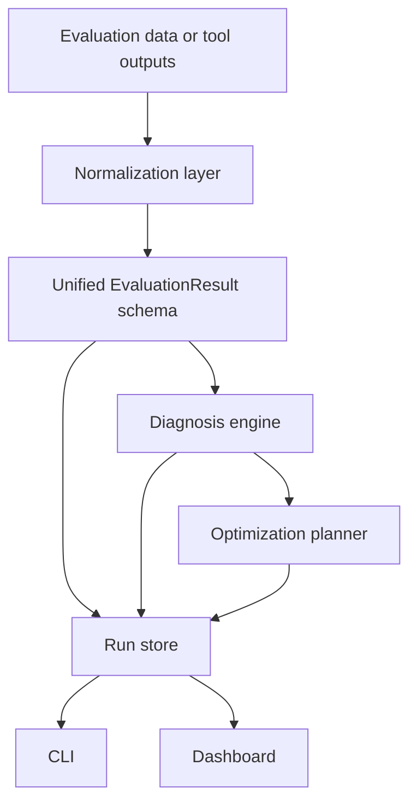

# ragdx

`ragdx` is a Python library for evaluating, diagnosing, comparing, and improving Retrieval-Augmented Generation (RAG) systems.

It is designed as a control plane around existing tools rather than a replacement for them:

- **Ragas** for broad metric coverage
- **RAGChecker** for fine-grained retriever and generator diagnosis
- **DSPy** for prompt and program optimization
- **AutoRAG** for retrieval-pipeline search

The library provides a normalized metric schema, a root-cause diagnosis engine, an optimization planner, a run store, a CLI, and a lightweight Streamlit dashboard.

---

## 1. Goals

RAG evaluation is often fragmented:

- retrieval quality is measured in one tool
- generation quality is judged in another
- end-to-end outcomes are tracked separately
- optimization runs are scattered across notebooks, scripts, and ad hoc spreadsheets

`ragdx` brings these pieces into one workflow:

1. ingest metrics from one or more RAG evaluation tools
2. normalize them into a shared schema
3. diagnose probable root causes when performance is below expectation
4. propose optimization experiments against the most likely bottlenecks
5. save runs and compare them over time
6. inspect results in a simple dashboard

This makes it easier to answer questions such as:

- Is the problem mainly **retrieval recall**, **retrieval precision**, or **generator grounding**?
- Is low answer quality caused by **missing evidence** or **poor synthesis**?
- Should the next iteration focus on **chunking**, **retriever/reranker**, **prompt/program optimization**, or **joint ablations**?
- Is the current run actually better than the baseline, and on which metrics?

---

## 2. Scope

### What `ragdx` does today

- defines a **unified evaluation schema** for retrieval, generation, and end-to-end RAG metrics
- normalizes precomputed outputs from **Ragas** and **RAGChecker**
- loads dataset records from **JSON**, **JSONL**, and **CSV**
- runs a **rule-based diagnosis engine** to generate hypotheses and recommended actions
- optionally supports an **LLM-based diagnosis explainer** on top of the rule-based report
- generates a structured **optimization plan** mapped to DSPy and AutoRAG style workflows
- stores runs under a local run store
- compares runs and exports markdown reports
- provides a **CLI** and **Streamlit dashboard**

### What `ragdx` does not fully automate yet

- it does **not** hardwire a full live execution path into every supported external library version
- it does **not** guarantee API stability across future versions of Ragas, RAGChecker, DSPy, or AutoRAG
- it does **not** replace your RAG stack, orchestration framework, or evaluation dataset design

Instead, it is intentionally designed to be a stable layer **above** those libraries.

---

## 3. Architecture

### Logical layers



### Package structure

```text
rag_diagnosis_lib_v3/
├── README.md
├── pyproject.toml
├── examples/
│   ├── demo_evaluation.json
│   └── demo_evaluation_baseline.json
├── src/
│   └── ragdx/
│       ├── __init__.py
│       ├── cli.py
│       ├── demo.py
│       ├── core/
│       │   ├── compare.py
│       │   ├── datasets.py
│       │   ├── diagnosis.py
│       │   ├── evaluator.py
│       │   ├── normalization.py
│       │   └── thresholds.py
│       ├── engines/
│       │   ├── llm_diagnosis.py
│       │   ├── ragas_adapter.py
│       │   ├── ragchecker_adapter.py
│       │   └── root_cause.py
│       ├── optim/
│       │   ├── autorag_adapter.py
│       │   ├── dspy_adapter.py
│       │   └── planner.py
│       ├── schemas/
│       │   └── models.py
│       ├── storage/
│       │   └── run_store.py
│       ├── ui/
│       │   └── dashboard.py
│       └── utils/
│           └── reporting.py
└── tests/
    ├── test_compare_and_store.py
    └── test_diagnosis.py
```

---

## 4. Core concepts

### 4.1 Evaluation layers

`ragdx` organizes metrics into three layers.

#### Retrieval layer

Typical examples:

- `context_precision`
- `context_recall`
- `context_entities_recall`
- `hit_rate_at_k`

These indicate whether the retriever is finding relevant evidence and whether it is returning too much noise.

#### Generation layer

Typical examples:

- `faithfulness`
- `response_relevancy`
- `context_utilization`
- `noise_sensitivity`
- `hallucination`

These indicate whether the generator is using the retrieved evidence properly and whether it remains stable in the presence of distractors or weak context.

#### End-to-end layer

Typical examples:

- `answer_correctness`
- `answer_accuracy`
- `citation_accuracy`
- `user_success_rate`

These reflect the actual user-facing quality of the system.

### 4.2 Unified schema

The core normalized object is `EvaluationResult`.

```python
from ragdx.schemas.models import EvaluationResult

result = EvaluationResult(
    retrieval={
        "context_precision": 0.63,
        "context_recall": 0.57,
        "context_entities_recall": 0.54,
        "hit_rate_at_k": 0.64,
    },
    generation={
        "faithfulness": 0.79,
        "response_relevancy": 0.82,
        "noise_sensitivity": 0.31,
        "context_utilization": 0.61,
        "hallucination": 0.19,
    },
    e2e={
        "answer_correctness": 0.68,
        "citation_accuracy": 0.71,
        "user_success_rate": 0.69,
    },
    metadata={"dataset": "demo"},
)
```

This shared object is what the diagnosis engine, optimization planner, run store, CLI, and dashboard consume.

---

## 5. Diagnosis model

The diagnosis flow is intentionally two-stage.

### Stage 1: rule-based root-cause analysis

The default engine examines metric gaps against configured thresholds and generates hypotheses such as:

- **evidence miss despite acceptable retrieval precision**
- **retrieval noise or weak ranking quality**
- **generator is not grounding sufficiently on retrieved evidence**
- **answer is fragile under distractors or unsupported reasoning**
- **citation mapping is weaker than answer generation**

This stage is deterministic, transparent, and easy to audit.

### Stage 2: optional LLM-based explanation

You may optionally add an LLM-based explainer to refine the report and produce richer causal reasoning, while still grounding the explanation in the normalized metrics and the initial rule-based diagnosis.

### Default thresholds

`ragdx` ships with practical default thresholds in `src/ragdx/core/thresholds.py`.

Examples:

- `context_precision`: `0.80`
- `context_recall`: `0.80`
- `faithfulness`: `0.90`
- `response_relevancy`: `0.85`
- `noise_sensitivity`: `0.20`  
  lower is better
- `hallucination`: `0.10`  
  lower is better
- `answer_correctness`: `0.85`
- `citation_accuracy`: `0.85`

You can override these thresholds when instantiating the analyzer.

---

## 6. Optimization model

The diagnosis engine emits **optimization candidates**, which the planner translates into structured experiments.

### Example experiment families

#### AutoRAG-oriented retrieval search

Used when the issue is mainly in retrieval coverage, ranking quality, or evidence packing.

Typical search dimensions:

- chunk size
- chunk overlap
- retriever type
- reranker type
- context packing strategy
- `top_k`

#### DSPy-oriented generator optimization

Used when retrieval is acceptable but synthesis, grounding, or citation behavior is weak.

Typical optimization targets:

- answer synthesis prompt
- decomposition prompt
- citation behavior
- verifier or claim-checking prompt

#### Joint ablations

Used when the failure mode is mixed or ambiguous.

Typical ablations:

- retrieval only
- retrieval + reranker
- prompt only
- citation prompt only
- joint configuration

The current planner emits a **plan**. It does not yet execute every optimization loop end to end for every supported library version.

---

## 7. Installation

### Python version

This package is intended for **Python 3.10 or above**.

### Base installation

```bash
pip install -e .
```

### Install with all optional tool integrations

```bash
pip install -e ".[all]"
```

### Install individual optional integrations

```bash
pip install -e ".[ragas]"
pip install -e ".[ragchecker]"
pip install -e ".[dspy]"
pip install -e ".[autorag]"
pip install -e ".[openai]"
```

### Recommended virtual environment setup

Linux or macOS:

```bash
python -m venv .venv
source .venv/bin/activate
pip install --upgrade pip
pip install -e ".[all]"
```

Windows PowerShell:

```powershell
python -m venv .venv
.\.venv\Scripts\Activate.ps1
python -m pip install --upgrade pip
pip install -e ".[all]"
```

---

## 8. Quick start

### 8.1 Diagnose a normalized evaluation file

```bash
ragdx diagnose examples/demo_evaluation.json
```

### 8.2 Save a run

```bash
ragdx save examples/demo_evaluation.json --name demo-run --tags demo,baseline
```

### 8.3 List saved runs

```bash
ragdx runs
```

### 8.4 Compare two evaluation files

```bash
ragdx compare examples/demo_evaluation.json examples/demo_evaluation_baseline.json
```

### 8.5 Export a markdown report for a saved run

```bash
ragdx export-report <RUN_ID> report.md
```

### 8.6 Normalize raw tool outputs

```bash
ragdx normalize-tools --ragas-json ragas_scores.json --ragchecker-json ragchecker_scores.json --output-json normalized_evaluation.json
```

### 8.7 Launch the dashboard

```bash
ragdx dashboard
```

or

```bash
streamlit run src/ragdx/ui/dashboard.py
```

---

## 9. CLI reference

The package exposes the `ragdx` CLI entrypoint.

### `ragdx diagnose`

Diagnose a normalized evaluation JSON and print a diagnosis report.

```bash
ragdx diagnose examples/demo_evaluation.json
```

### `ragdx save`

Save an evaluation plus diagnosis and optimization plan into the local run store.

```bash
ragdx save examples/demo_evaluation.json --name my-run --tags exp1,retrieval
```

### `ragdx runs`

List previously saved runs.

```bash
ragdx runs
```

### `ragdx compare`

Compare a current evaluation file with a baseline evaluation file.

```bash
ragdx compare current.json baseline.json
```

### `ragdx export-report`

Export a saved run as a markdown report.

```bash
ragdx export-report 123456abcdef report.md
```

### `ragdx normalize-tools`

Read raw metric payloads from tool outputs, map them into the shared schema, and write a normalized JSON file.

```bash
ragdx normalize-tools \
  --ragas-json ragas_scores.json \
  --ragchecker-json ragchecker_scores.json \
  --output-json normalized_evaluation.json
```

### `ragdx dashboard`

Launch the Streamlit dashboard.

```bash
ragdx dashboard
```

---

## 10. Dashboard

The Streamlit dashboard provides five views:

- **Scores**: grouped metric overview across retrieval, generation, and end-to-end layers
- **Diagnosis**: summary, metric gaps, hypotheses, and priority actions
- **Optimization**: proposed experiments from the optimization planner
- **Compare**: saved-run comparison view
- **Raw JSON**: normalized evaluation payload inspection

The dashboard can either:

- load an uploaded normalized evaluation JSON
- use the latest saved run from `.ragdx/runs`

This makes it suitable both for ad hoc inspection and for iterative experiment tracking.

---

## 11. Data model

### 11.1 DatasetRecord

The package uses `DatasetRecord` as a common record schema.

```python
from ragdx.schemas.models import DatasetRecord

record = DatasetRecord(
    question="What is the bank's CET1 ratio?",
    ground_truth="The CET1 ratio is 14.2%.",
    answer="The CET1 ratio is 14.2%.",
    contexts=[
        "The bank reported a CET1 ratio of 14.2% for FY2025.",
        "Other capital metrics were also disclosed."
    ],
    reference_contexts=[
        "The bank reported a CET1 ratio of 14.2% for FY2025."
    ],
    citations=[0],
    metadata={"doc_type": "annual_report", "entity": "Example Bank"},
)
```

Fields:

- `question`: user query
- `ground_truth`: reference answer
- `answer`: generated answer
- `contexts`: retrieved contexts actually supplied to the model
- `reference_contexts`: gold or reference contexts if available
- `citations`: indices or identifiers of cited supporting passages
- `metadata`: extra fields such as source, entity, report type, or split

### 11.2 Loading datasets

`ragdx` supports loading from:

- `.json`
- `.jsonl`
- `.csv`

The helper is in `ragdx.core.datasets`.

```python
from ragdx.core.datasets import load_records

records = load_records("my_eval_set.jsonl")
```

#### JSON format

Either a list of records or a dictionary with a top-level `records` field.

```json
[
  {
    "question": "What is the revenue growth?",
    "ground_truth": "Revenue grew by 8%.",
    "answer": "Revenue grew by 8%.",
    "contexts": ["Revenue increased 8% year on year."],
    "reference_contexts": ["Revenue increased 8% year on year."],
    "metadata": {"split": "test"}
  }
]
```

#### JSONL format

One `DatasetRecord`-compatible JSON object per line.

```json
{"question":"Q1","ground_truth":"A1","answer":"A1","contexts":["C1"]}
{"question":"Q2","ground_truth":"A2","answer":"A2","contexts":["C2"]}
```

#### CSV format

Expected columns:

- `question`
- `ground_truth`
- `answer`
- `contexts`
- `reference_contexts`

For CSV, context lists are encoded using `||` as the separator.

Example:

```csv
question,ground_truth,answer,contexts,reference_contexts,split
What is NIM?,NIM is 1.8%,NIM is 1.8%,Net interest margin was 1.8%||Funding costs rose,Net interest margin was 1.8%,test
```

---

## 12. Evaluation JSON format

A normalized evaluation file generally looks like this:

```json
{
  "retrieval": {
    "context_precision": 0.63,
    "context_recall": 0.57,
    "context_entities_recall": 0.54,
    "hit_rate_at_k": 0.64
  },
  "generation": {
    "faithfulness": 0.79,
    "response_relevancy": 0.82,
    "noise_sensitivity": 0.31,
    "context_utilization": 0.61,
    "hallucination": 0.19
  },
  "e2e": {
    "answer_correctness": 0.68,
    "citation_accuracy": 0.71,
    "user_success_rate": 0.69
  },
  "metadata": {
    "dataset": "demo",
    "notes": "retrieval recall and generator grounding are both weak"
  },
  "raw_tool_outputs": {}
}
```

This is the preferred exchange format between scripts, the CLI, and the dashboard.

---

## 13. Tool adapters

### 13.1 Ragas adapter

Location:

- `src/ragdx/engines/ragas_adapter.py`

What it does:

- checks that `ragas` is installed
- normalizes precomputed Ragas metrics into `EvaluationResult`
- can prepare a Ragas-friendly record payload from `DatasetRecord` instances

Example:

```python
from ragdx.engines.ragas_adapter import RagasAdapter
from ragdx.schemas.models import DatasetRecord

adapter = RagasAdapter()

records = [
    DatasetRecord(
        question="What is ROE?",
        ground_truth="ROE is 11.3%.",
        answer="ROE is 11.3%.",
        contexts=["Return on equity was 11.3% in FY2025."],
        reference_contexts=["Return on equity was 11.3% in FY2025."],
    )
]

result = adapter.evaluate(
    records,
    raw_scores={
        "context_precision": 0.81,
        "context_recall": 0.77,
        "faithfulness": 0.88,
        "response_relevancy": 0.86,
        "answer_correctness": 0.83,
    },
)
```

If `raw_scores` is omitted, the adapter returns a prepared payload structure suitable for use with your installed Ragas workflow.

### 13.2 RAGChecker adapter

Location:

- `src/ragdx/engines/ragchecker_adapter.py`

What it does:

- checks that `ragchecker` is installed
- normalizes precomputed RAGChecker metrics into `EvaluationResult`
- can prepare a RAGChecker-friendly record payload

Example:

```python
from ragdx.engines.ragchecker_adapter import RAGCheckerAdapter

adapter = RAGCheckerAdapter()
result = adapter.normalize_scores(
    {
        "precision": 0.74,
        "recall": 0.69,
        "context_utilization": 0.66,
        "hallucination": 0.14,
        "faithfulness": 0.84,
    }
)
```

### 13.3 Why the adapters are version-tolerant

The RAG tool ecosystem evolves quickly. `ragdx` therefore treats these adapters as **stable normalization boundaries** instead of hardcoding fragile assumptions about every external API version.

That keeps the package useful even when:

- a library changes its execution API
- your environment already has a preferred evaluation wrapper
- you want to ingest exported metrics rather than call the tool directly

---

## 14. Programmatic usage

### 14.1 Diagnose an evaluation result

```python
from ragdx.core.diagnosis import RAGDiagnosisEngine
from ragdx.schemas.models import EvaluationResult

result = EvaluationResult(
    retrieval={"context_precision": 0.63, "context_recall": 0.57},
    generation={"faithfulness": 0.79, "hallucination": 0.19},
    e2e={"answer_correctness": 0.68, "citation_accuracy": 0.71},
)

engine = RAGDiagnosisEngine()
report = engine.diagnose(result)

print(report.summary)
for h in report.hypotheses:
    print(h.component, h.root_cause, h.confidence)
```

### 14.2 Build an optimization plan

```python
from ragdx.optim.planner import OptimizationPlanner

planner = OptimizationPlanner()
plan = planner.build_plan(report, objective_metric="answer_correctness")

for exp in plan.experiments:
    print(exp.name, exp.tool, exp.parameters)
```

### 14.3 Save and load runs

```python
from ragdx.storage.run_store import RunStore

store = RunStore()
saved = store.save_run(
    evaluation=result,
    diagnosis=report,
    plan=plan,
    name="demo-run",
    tags=["demo", "baseline"],
)

loaded = store.load_run(saved.run_id)
print(loaded.name, loaded.created_at)
```

### 14.4 Compare results

```python
from ragdx.core.compare import compare_results

comparisons = compare_results(current_result, baseline_result)
for item in comparisons:
    print(item.metric, item.delta, item.direction)
```

### 14.5 Export a markdown report

```python
store.export_markdown(saved.run_id, "report.md")
```

---

## 15. Run store

Saved runs are stored under:

```text
.ragdx/runs/
```

Each run contains:

- run metadata
- normalized evaluation
- diagnosis report
- optimization plan
- optional baseline linkage

This allows you to treat RAG evaluation as an iterative engineering workflow rather than a one-off script output.

---

## 16. Report export

A saved run can be exported as markdown for sharing or versioning.

Example output sections:

- run metadata
- summary
- retrieval metrics
- generation metrics
- end-to-end metrics
- hypotheses
- planned experiments

This is useful when you want a human-readable artifact for design reviews, model governance, or experiment tracking.

---

## 17. Example workflow

A practical workflow looks like this:

1. run your RAG system on an evaluation dataset
2. compute metrics with Ragas, RAGChecker, or both
3. normalize the outputs into `EvaluationResult`
4. run `ragdx diagnose`
5. inspect the hypotheses and priority actions
6. save the run
7. apply one or more optimization experiments
8. rerun the evaluation
9. compare the new run with the baseline
10. export a report or inspect results in the dashboard

### Example workflow script

```python
from ragdx.core.diagnosis import RAGDiagnosisEngine
from ragdx.optim.planner import OptimizationPlanner
from ragdx.schemas.models import EvaluationResult
from ragdx.storage.run_store import RunStore

baseline = EvaluationResult(
    retrieval={"context_precision": 0.59, "context_recall": 0.51},
    generation={"faithfulness": 0.74, "hallucination": 0.23},
    e2e={"answer_correctness": 0.62, "citation_accuracy": 0.66},
    metadata={"dataset": "qa-v1", "run_type": "baseline"},
)

engine = RAGDiagnosisEngine()
planner = OptimizationPlanner()
store = RunStore()

report = engine.diagnose(baseline)
plan = planner.build_plan(report)
saved = store.save_run(baseline, report, plan, name="qa-v1-baseline", tags=["baseline"])

print(saved.run_id)
print(report.summary)
for action in report.priority_actions:
    print("-", action)
```

---

## 18. Integration patterns

### Pattern A: metrics-first integration

Use your existing evaluation stack to compute metrics, then pass the results into `ragdx`.

Best when:

- you already have stable Ragas or RAGChecker scripts
- you want diagnosis and experiment planning without changing your current pipeline

### Pattern B: prepared-payload integration

Use `ragdx` dataset loaders and tool adapters to prepare records for your installed evaluation tools.

Best when:

- you want a consistent schema across teams
- you are standardizing evaluation input formats

### Pattern C: run-governance layer

Use `ragdx` to save runs, compare baselines, and export reports, while leaving live execution to your existing RAG platform.

Best when:

- you need traceability across experiments
- you want a lightweight evaluation governance layer

---

## 19. Extending the package

### Add a new metric normalization map

Edit:

- `src/ragdx/core/normalization.py`

Map external tool metrics into the internal retrieval, generation, or end-to-end buckets.

### Add a new diagnosis rule

Edit:

- `src/ragdx/engines/root_cause.py`

Recommended approach:

1. define the triggering metric pattern
2. define the severity and confidence
3. add concise evidence statements
4. add remediation actions
5. emit one or more optimization candidates

### Add a new optimizer backend

Add or extend:

- `src/ragdx/optim/`

Then update the planner to emit experiment definitions for that backend.

### Add a new UI view

Edit:

- `src/ragdx/ui/dashboard.py`

Typical additions might include:

- per-example failure inspection
- confidence trend charts across runs
- retrieval versus generation attribution heatmaps

---

## 20. Testing

Run the test suite with:

```bash
PYTHONPATH=src pytest -q
```

Current tests cover:

- diagnosis generation
- run saving and comparison behavior

As the package evolves, useful additional tests would include:

- normalization correctness against canonical tool outputs
- threshold override behavior
- run export integrity
- dashboard-safe loading of partial evaluation payloads

---

## 21. Compatibility notes

This package is intended for **Python 3.10+**.

The dependency ranges in `pyproject.toml` are bounded to reduce future breakage from upstream packages raising their Python floor.

Even with those protections, live integration behavior can still vary across versions of:

- `ragas`
- `ragchecker`
- `dspy`
- `AutoRAG`
- `openai`

For production or team-wide deployment, it is a good idea to maintain:

- a pinned lock file
- a reproducible virtual environment
- a small compatibility test suite against your preferred versions

---

## 22. Limitations

Current limitations include:

- no full automatic execution of every supported external tool workflow
- no built-in claim-level error browser yet
- no built-in retrieval corpus inspector yet
- no experiment scheduler or distributed optimization runner yet
- no native notebook widget or multi-user backend yet

These are reasonable next steps if the package evolves into a larger operational workbench.

---

## 23. Recommended next development steps

High-value next steps would be:

1. add an end-to-end runner for one concrete stack such as **LangChain** or **LlamaIndex**
2. support direct ingestion of per-example outputs, not only aggregate metrics
3. add claim-level diagnosis and citation tracing
4. execute DSPy optimization loops directly, not just stage them
5. execute AutoRAG search runs directly, not just stage them
6. add before/after optimizer result registration into the run store
7. add a richer dashboard for slice analysis and difficult-example inspection

---

## 24. License and authorship

MIT License

---

## 25. Minimal checklist for real use

Before using `ragdx` in a serious RAG improvement workflow, confirm that you have:

- a representative evaluation dataset
- at least one trusted metric source such as Ragas or RAGChecker
- a documented baseline run
- stable metric normalization mappings
- clear optimization objectives, such as `answer_correctness` or `citation_accuracy`
- a reproducible runtime for DSPy and AutoRAG if you intend to execute the plans

Once those are in place, `ragdx` becomes a useful engineering layer for structured diagnosis and iterative improvement.


## LLM diagnosis

`ragdx` now supports three diagnosis modes from the CLI:

- default: rule-based diagnosis
- `--use-llm`: run the LLM diagnosis path using the rule-based report as structured input
- `--use-both`: run rule-based diagnosis, run LLM diagnosis, then summarize both reports with the LLM into one final report

Install the OpenAI extra first:

```bash
pip install -e ".[openai]"
```

Set the API key and optional model name:

```bash
export OPENAI_API_KEY=your_key
export RAGDX_OPENAI_MODEL=gpt-5.4-thinking
```

Examples:

```bash
ragdx diagnose examples/demo_evaluation.json
ragdx diagnose examples/demo_evaluation.json --use-llm
ragdx diagnose examples/demo_evaluation.json --use-both
ragdx save examples/demo_evaluation.json --name demo-llm --use-both
```

### Diagnosis flow

With `--use-llm`, the package:

1. runs deterministic rule-based diagnosis internally
2. packages thresholds, metrics, metadata, and the rule-based report into a structured prompt
3. asks the LLM to return a strict JSON `DiagnosisReport`

With `--use-both`, the package:

1. runs deterministic rule-based diagnosis
2. runs the LLM refinement pass
3. asks the LLM to synthesize the rule-based and LLM reports into one final diagnosis report

### Prompt design

The LLM prompt was refined to:

- separate retrieval, ranking/noise, grounding, citation, and pipeline failures
- prefer causal explanations over surface restatement
- remain conservative when the metrics do not support a strong claim
- return strict JSON only
- order actions by likely execution priority

### Environment notes

- `OPENAI_API_KEY` is required for `--use-llm` and `--use-both`
- `RAGDX_OPENAI_MODEL` is optional and defaults to `gpt-5.4-thinking`
- if you do not install the `openai` extra, rule-based diagnosis still works normally
