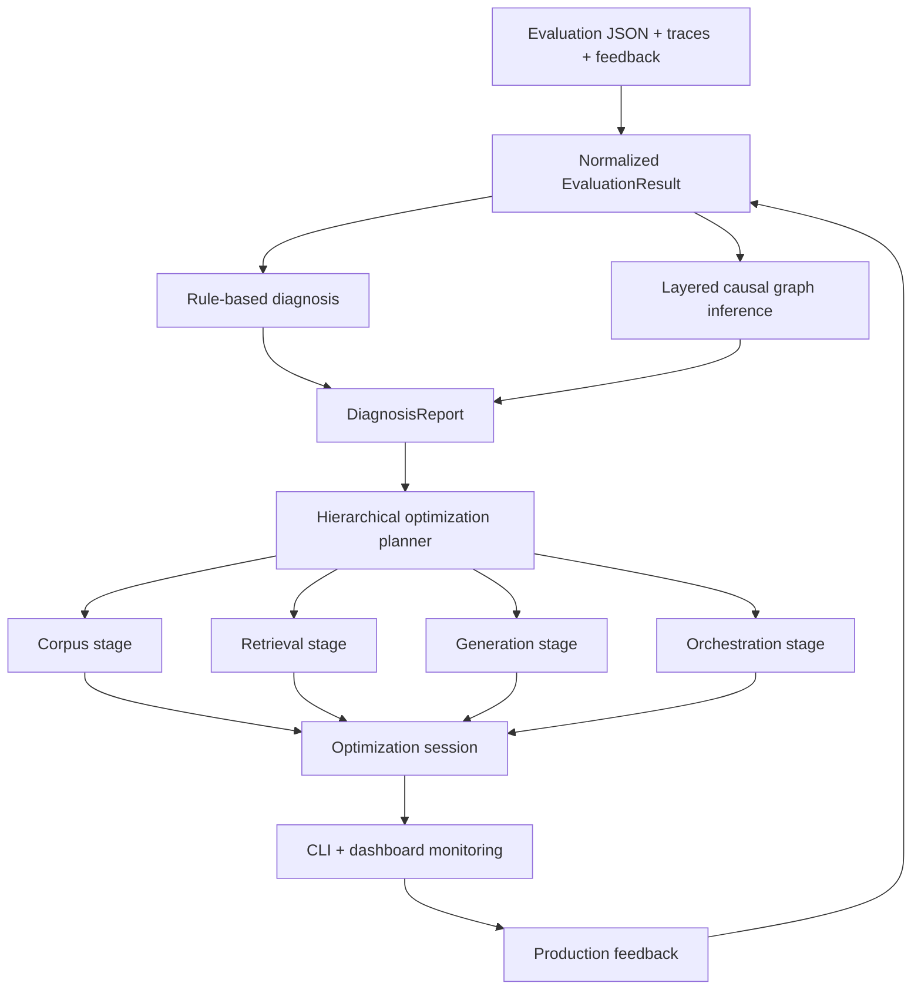

# ragdx

## What is new in v0.6.1

This release upgrades `ragdx` from a metric-and-optimization tool into a more complete **closed-loop RAGOps control plane**.

New capabilities:

- trace-aware evaluation schema
- feedback-aware run storage
- explicit layered causal graph with nodes, weighted edges, evidence propagation, and feedback-adjusted priors
- evaluator agreement and diagnosis confidence tracking
- hierarchical optimization plan stages:
  - corpus
  - retrieval
  - generation
  - orchestration
  - joint
- feasible constrained multi-objective optimization with hard constraint checks, penalty-aware utility, and feasible Pareto fronts
- dashboard tabs for traces, production feedback, and governance
- CLI support for attaching feedback to saved runs

## Core architecture



## Package structure

```text
rag_diagnosis_lib_v3/
├── README.md
├── pyproject.toml
├── examples/
├── src/
│   └── ragdx/
│       ├── cli.py
│       ├── core/
│       ├── engines/
│       ├── optim/
│       ├── schemas/
│       ├── storage/
│       └── ui/
└── tests/
```

## Installation

### Base install

```bash
pip install -e .
```

### With LLM diagnosis

```bash
pip install -e ".[openai]"
```

### With the full tool stack

```bash
pip install -e ".[all]"
```

Python requirement:

- Python **3.10 or above**

## Normalized evaluation schema

`ragdx` accepts a normalized `EvaluationResult` schema.

### Minimal example

```json
{
  "retrieval": {
    "context_precision": 0.63,
    "context_recall": 0.57,
    "context_entities_recall": 0.54,
    "hit_rate_at_k": 0.64
  },
  "generation": {
    "faithfulness": 0.79,
    "response_relevancy": 0.82,
    "noise_sensitivity": 0.31,
    "context_utilization": 0.61,
    "hallucination": 0.19
  },
  "e2e": {
    "answer_correctness": 0.68,
    "citation_accuracy": 0.71,
    "user_success_rate": 0.69
  },
  "metadata": {
    "dataset": "demo",
    "tools": ["ragas", "ragchecker"]
  }
}
```

### Extended example with traces and feedback

```json
{
  "retrieval": {"context_precision": 0.63, "context_recall": 0.57},
  "generation": {"faithfulness": 0.79, "hallucination": 0.19},
  "e2e": {"answer_correctness": 0.68, "citation_accuracy": 0.71},
  "metadata": {"dataset": "prod-slice-apr", "dataset_shift": true},
  "traces": [
    {
      "trace_id": "t1",
      "question": "What is the emissions target?",
      "answer": "The firm targets net zero by 2050.",
      "retrieved_chunks": [{"doc_id": "r1", "score": 0.81}],
      "citations": [1],
      "latency_ms": 1420,
      "cost_usd": 0.008
    }
  ],
  "feedback_events": [
    {
      "feedback_id": "fb1",
      "query_id": "t1",
      "kind": "user_correction",
      "severity": "medium",
      "rating": 0.0,
      "note": "The target year is incorrect."
    }
  ],
  "evaluator_scores": [
    {"evaluator": "ragas", "metric": "faithfulness", "score": 0.79},
    {"evaluator": "ragchecker", "metric": "faithfulness", "score": 0.73}
  ],
  "calibrations": [
    {"metric": "faithfulness", "agreement_score": 0.82, "audit_sample_size": 35}
  ]
}
```

## Diagnosis model

`ragdx` now combines three layers:

1. **deterministic diagnosis** from metric gaps
2. **Bayesian-style causal signals** that incorporate traces, feedback, and evaluator agreement
3. **optional LLM refinement** using `--use-llm` or `--use-both`

### Diagnosis output additions

A `DiagnosisReport` now includes:

- `causal_signals`
- `evaluator_agreement`
- `diagnosis_confidence`
- `disambiguation_actions`

### Typical causal nodes

Examples:

- `corpus_chunking_defect`
- `retrieval_recall_defect`
- `retrieval_precision_defect`
- `context_packing_defect`
- `grounding_defect`
- `citation_binding_defect`
- `judge_or_metric_instability`
- `distribution_shift`

## Hierarchical optimization planning

The planner no longer emits only one generic retrieval or generator search.

It now builds staged plans based on diagnosis:

### 1. Corpus stage

Examples:

- parser selection
- structure preservation
- chunk size and overlap
- table handling

### 2. Retrieval stage

Examples:

- retriever type
- embedding model
- reranker
- top-k
- query rewriting
- context ordering

### 3. Generation stage

Examples:

- DSPy optimizer choice
- few-shot count
- prompt style
- verifier use
- citation behavior

### 4. Orchestration stage

Examples:

- retry retrieval
- follow-up question policy
- abstention policy
- planner type
- context budget

### 5. Joint stage

Used when the diagnosis is mixed or inconclusive.

## Optimization constraints

Every planned experiment can carry hard or soft operational constraints, for example:

- maximum hallucination
- maximum noise sensitivity
- maximum latency
- maximum cost

This is intended to prevent optimization from improving one metric by degrading risk or operating characteristics too far.


## Baseline-relative planning semantics

Generated plans now separate four concepts clearly:

- `parameters.baseline_metrics`: the observed baseline values used for planning
- `objectives`: trade-off weights used by the optimizer, not target metric values
- `parameters.target_thresholds`: concrete numeric target region for each metric
- `parameters.target_specs`: per-metric semantics including direction (`maximize`/`minimize`), mode (`improve`/`maintain`/`reduce`), baseline value, delta from baseline, and acceptable bounds

This avoids the earlier ambiguity where objective weights could be misread as target values. The planner also guards against regressive targets: maximize metrics are no longer set below the current baseline, and minimize metrics are no longer set above the current baseline unless an explicit LLM override or diagnosis requires it.

## CLI reference

### Diagnose

```bash
ragdx diagnose examples/demo_evaluation.json
ragdx diagnose examples/demo_evaluation.json --use-llm
ragdx diagnose examples/demo_evaluation.json --use-both
```

### Plan

```bash
ragdx plan examples/demo_evaluation.json --strategy bayesian --budget 12
ragdx plan examples/demo_evaluation.json --strategy pareto_evolutionary --budget 16
```

### Optimize

```bash
ragdx optimize examples/demo_evaluation.json --strategy bayesian --budget 12 --mode simulate
ragdx optimize examples/demo_evaluation.json --strategy pareto_evolutionary --budget 16 --mode prepare_only
ragdx optimize examples/demo_evaluation.json --strategy bayesian --budget 12 --mode execute --use-both
```

### Runs and sessions

```bash
ragdx runs
ragdx sessions
ragdx monitor-session <SESSION_ID>
```

### Feedback loop

Attach a feedback file to an existing run:

```bash
ragdx attach-feedback <RUN_ID> examples/feedback_events.json
ragdx feedback-summary
```

The feedback JSON may be a single object or a list.

### Dashboard

```bash
ragdx dashboard
```

## Execution modes

### `simulate`

Runs the optimization workflow end to end inside `ragdx` using simulated scoring.

### `prepare_only`

Writes executable config artifacts without launching external runners.

### `execute`

Uses configured external runner command templates and ingests result JSON files back into the optimization session.

## External runner configuration

Set environment variables for external trial launchers:

```bash
export RAGDX_DSPY_RUNNER_CMD='python examples/run_external_trial_example.py --config {config} --output {output}'
export RAGDX_AUTORAG_RUNNER_CMD='python examples/run_external_trial_example.py --config {config} --output {output}'
```

Supported placeholders:

- `{config}`
- `{output}`
- `{workdir}`
- `{trial_id}`
- `{session_id}`
- `{tool}`

## Dashboard views

The Streamlit dashboard includes:

- **Scores**
- **Diagnosis**
- **Optimization Plan**
- **Optimization Sessions**
- **Traces**
- **Feedback & Governance**
- **Compare**
- **Raw JSON**

## Programmatic usage

```python
from ragdx.core.diagnosis import RAGDiagnosisEngine
from ragdx.optim.planner import OptimizationPlanner
from ragdx.schemas.models import EvaluationResult

result = EvaluationResult(
    retrieval={"context_precision": 0.63, "context_recall": 0.57},
    generation={"faithfulness": 0.79, "hallucination": 0.19},
    e2e={"answer_correctness": 0.68, "citation_accuracy": 0.71},
)

report = RAGDiagnosisEngine().diagnose(result)
plan = OptimizationPlanner().build_plan(report, result=result, strategy="bayesian", budget=12)

print(report.summary)
for signal in report.causal_signals[:3]:
    print(signal.node, signal.posterior)
for exp in plan.experiments:
    print(exp.stage, exp.name)
```

## Testing

```bash
PYTHONPATH=src pytest -q
```

## Limitations

This release adds stronger control-plane logic, but some boundaries remain:

- external DSPy and AutoRAG execution still depends on your local runtime and dataset wiring
- Bayesian causal signals are heuristic and probabilistic, not formally learned from historical labeled failures yet
- evaluator agreement is useful, but not a substitute for a human-audited calibration set

## Suggested next step

The next natural upgrade is to add:

- true OpenTelemetry span ingestion
- evaluator ensemble calibration against gold labels
- online canary tracking and rollback states
- benchmark evolution from clustered production failures


## What is new in v0.7.0

This version closes the remaining major gaps from the earlier patches.

- Explicit causal graph inference using a directed graph with weighted propagation
- Persistent causal prior learning stored under `.ragdx/causal/priors.json`
- Constraint-aware model-based optimization using Gaussian-process surrogates over the finite search space
- Feasibility-aware candidate selection using predicted feasibility probability and expected hypervolume improvement
- Session-level hypervolume and feasible hypervolume tracking
- Dashboard support for feasibility and hypervolume monitoring

### Constrained optimization

The Bayesian optimization path is now multi-objective and constraint-aware. For each experiment, ragdx:

1. fits surrogate models for objective and constraint metrics from completed trials
2. estimates feasibility probability for each unseen candidate
3. estimates expected hypervolume improvement over the current feasible Pareto front
4. ranks candidates using feasibility, hypervolume improvement, scalar utility, and exploration

This is materially stronger than the earlier weighted-utility-only trial ordering.

### Layered causal graph

The diagnosis engine now uses an explicit directed causal graph with weighted edges and persistent priors. Evidence comes from:

- metric gaps
- evaluator agreement
- trace-level attribution
- attached feedback events
- saved historical causal priors

Priors are updated after diagnosis so repeated production failures shift the starting probabilities for later runs.


## LangChain and LlamaIndex execution

`ragdx` can now emit executable trial configurations for LangChain and LlamaIndex and can launch them through runner commands. Set one or both of these environment variables:

```bash
export RAGDX_LANGCHAIN_RUNNER_CMD='python examples/run_langchain_trial.py --config {config} --output {output}'
export RAGDX_LLAMAINDEX_RUNNER_CMD='python examples/run_llamaindex_trial.py --config {config} --output {output}'
```

To make the planner include a runtime validation experiment, place the target runtime in the evaluation metadata:

```json
{
  "metadata": {
    "runtime_framework": "langchain",
    "dataset_path": "examples/demo_dataset.jsonl",
    "pipeline_module": "examples.langchain_pipeline:create_pipeline"
  }
}
```

or:

```json
{
  "metadata": {
    "runtime_framework": "llamaindex",
    "dataset_path": "examples/demo_dataset.jsonl",
    "pipeline_module": "examples.llamaindex_pipeline:create_query_engine"
  }
}
```

## Heavyweight Bayesian optimization backends

The default Bayesian search remains the built-in surrogate-based search. To use a heavyweight backend, set:

```bash
export RAGDX_BO_BACKEND=ax
```

When `ax-platform` is installed, `ragdx` uses an ask/tell loop to propose candidates for multi-objective experiments and to register completed trials with outcome constraints. If Ax is not installed or cannot initialize the experiment, `ragdx` falls back to the internal model-based search.

Recommended extras:

```bash
pip install -e ".[langchain,llamaindex,bo]"
```

## Examples

Show runner templates:

```bash
ragdx show-runner-templates
```

Run a LangChain-backed optimization session:

```bash
export RAGDX_LANGCHAIN_RUNNER_CMD='python examples/run_langchain_trial.py --config {config} --output {output}'
ragdx optimize examples/demo_evaluation_langchain.json --strategy bayesian --mode execute --budget 6
```

Run a LlamaIndex-backed optimization session:

```bash
export RAGDX_LLAMAINDEX_RUNNER_CMD='python examples/run_llamaindex_trial.py --config {config} --output {output}'
ragdx optimize examples/demo_evaluation_llamaindex.json --strategy bayesian --mode execute --budget 6
```


## Baseline-aware planner and LLM plan refinement

`OptimizationPlanner` no longer relies on fixed objective weights and static global constraints. It now computes:

- baseline-aware objective weights from the current scores and diagnosis gaps
- baseline-aware target thresholds for both maximize and minimize metrics
- tighter constraints when the current baseline is already stronger than a generic default

You can also ask the planner to use an LLM to refine the heuristic plan. The LLM sees the current baseline metrics, diagnosis report, heuristic plan, budget, and strategy, then returns JSON guidance to adjust:

- objective weights
- target thresholds
- constraint overrides
- focused subspaces in the search space
- experiment trial budgets

CLI examples:

```bash
export OPENAI_API_KEY=your_key
export RAGDX_OPENAI_MODEL=gpt-5.4-thinking

ragdx plan examples/demo_evaluation.json --use-llm-planner
ragdx optimize examples/demo_evaluation_langchain.json --use-llm-planner --mode execute --budget 6
ragdx save examples/demo_evaluation.json --use-llm-planner
```

Behavior notes:

- `--use-llm` or `--use-both` for diagnosis will also enable LLM-backed planning automatically
- `--use-llm-planner` can be used independently when you want rule-based diagnosis but LLM-refined planning
- if the LLM call fails or returns invalid JSON, the planner falls back to the deterministic baseline-aware heuristic plan


## Human-readable plan inspection

The optimizer now exposes two ways to inspect a baseline-relative plan more clearly.

Generate a plan and print a human-readable explanation:

```bash
ragdx plan examples/demo_evaluation.json --human-readable
```

Explain a saved JSON plan file:

```bash
ragdx explain-plan path/to/plan.json
```

The optimization-plan dashboard tab also renders each experiment as a baseline-relative metric table with:

- baseline value
- target value
- delta from baseline
- maximize/minimize direction
- improve/maintain/reduce mode
- objective weights
- constraint bounds

This makes it easier to distinguish between:

- objective weights, which are trade-off coefficients
- target thresholds, which are baseline-relative planning targets
- constraint bounds, which are feasibility limits

## What is new in v0.8.2

What changed

* plan output is now **baseline-relative and auditable**
* each experiment now includes, under `parameters`:

  * `baseline_metrics`
  * `metric_directions`
  * `target_thresholds`
  * `target_specs`
  * `constraint_bounds`
  * `objective_weights`
* `baseline_score` is now populated with the baseline value of the primary objective metric
* maximize metrics are no longer planned below baseline
* minimize metrics are no longer planned above baseline
* notes now explicitly state that `objectives` are trade-off weights, not target metric values
* README updated
* version bumped to `0.8.2`

What this fixes in your example

Previously, the plan mixed:

* trade-off weights
* target values
* constraint bounds

without enough semantics.

Now the generated plan separates them clearly. For example, instead of only this:

```json
"objectives": {
  "answer_correctness": 0.2343
}
```

you will also get explicit planning context such as:

```json
"parameters": {
  "baseline_metrics": {
    "answer_correctness": 0.89,
    "context_precision": 0.84,
    "latency_ms": 42.0
  },
  "metric_directions": {
    "answer_correctness": "maximize",
    "latency_ms": "minimize"
  },
  "target_thresholds": {
    "answer_correctness": 0.90,
    "context_precision": 0.86,
    "latency_ms": 40.0
  },
  "target_specs": {
    "answer_correctness": {
      "direction": "maximize",
      "mode": "improve",
      "baseline_value": 0.89,
      "target_value": 0.90,
      "delta_from_baseline": 0.01,
      "min_acceptable": 0.88
    }
  },
  "objective_weights": {
    "answer_correctness": 0.23
  }
}
```

So the plan is now much easier to interpret.

Validation

* local tests passed: `13 passed`

I also added a new test specifically for this patch:

* verifies baseline-relative fields exist
* verifies maximize targets are not below baseline
* verifies minimize targets are not above baseline
* verifies `objective_weights == objectives`

The next clean improvement would be to make the executor and dashboard render `target_specs` directly in a human-readable plan view instead of only dumping raw JSON.


## What is new in v0.8.3

What improved

* added a **human-readable plan explanation** layer
* added CLI option:

  * `ragdx plan ... --human-readable`
* added new CLI command:

  * `ragdx explain-plan <plan.json>`
* upgraded the dashboard’s **Optimization Plan** tab to show:

  * baseline-relative metric table
  * direction (`maximize` / `minimize`)
  * mode (`improve` / `maintain` / `reduce`)
  * baseline value
  * target value
  * delta from baseline
  * objective weights
  * constraint bounds
  * baseline vs target chart
* added tests for human-readable plan summaries
* validation passed: **15 tests**

Examples

Generate a readable plan directly:

```bash
ragdx plan examples/demo_evaluation.json --human-readable
```

Explain a saved JSON plan file:

```bash
ragdx explain-plan path/to/plan.json
```

This makes it much easier to distinguish:

* **objective weights**: trade-off coefficients
* **target thresholds / target specs**: baseline-relative planning goals
* **constraint bounds**: feasibility limits

The dashboard now also makes that distinction visually, instead of forcing you to interpret raw JSON.
